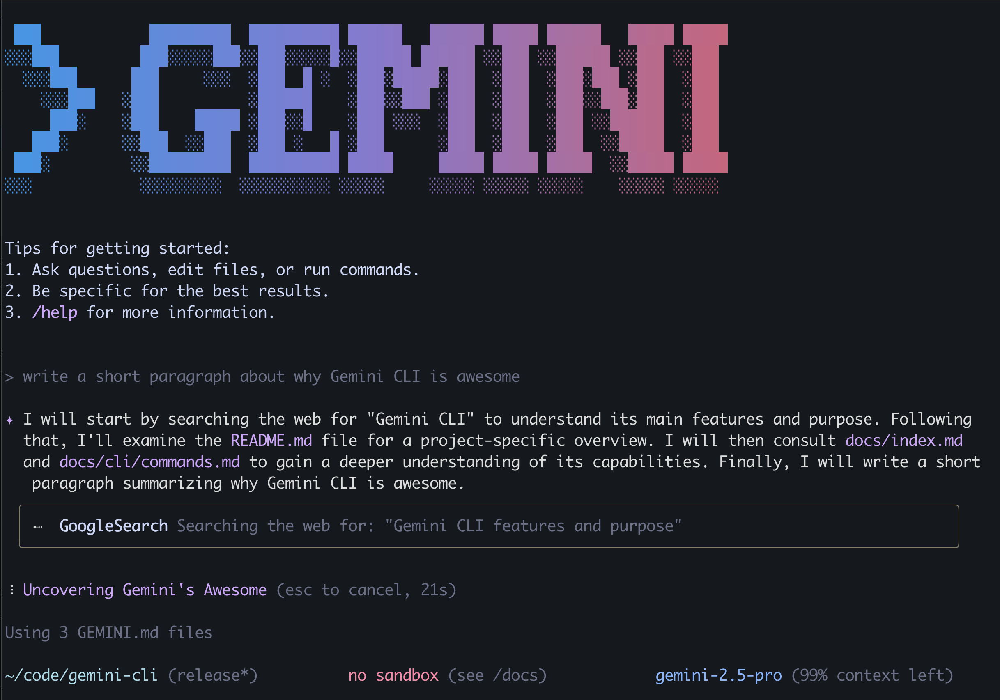

# Gemini CLI

[](https://github.com/google-gemini/gemini-cli/actions/workflows/ci.yml)



このリポジトリには、ツールに接続し、コードを理解し、ワークフローを高速化するコマンドラインAIワークフローツールであるGemini CLIが含まれています。

Gemini CLIを使用すると、次のことができます。

- Geminiの100万トークンのコンテキストウィンドウ内外の大規模なコードベースをクエリおよび編集します。
- Geminiのマルチモーダル機能を使用して、PDFやスケッチから新しいアプリを生成します。
- プルリクエストのクエリや複雑なリベースの処理など、運用タスクを自動化します。
- ツールとMCPサーバーを使用して、[Imagen、Veo、またはLyriaによるメディア生成](https://github.com/GoogleCloudPlatform/vertex-ai-creative-studio/tree/main/experiments/mcp-genmedia)を含む新しい機能を接続します。
- Geminiに組み込まれている[Google検索](https://ai.google.dev/gemini-api/docs/grounding)ツールでクエリをグラウンディングします。

## クイックスタート

1. **前提条件:** [Node.jsバージョン18](https://nodejs.org/en/download)以降がインストールされていることを確認してください。
2. **CLIの実行:** ターミナルで次のコマンドを実行します。

   ```bash
   npx https://github.com/google/gemini-cli
   ```

   または、次のようにインストールします。

   ```bash
   npm install -g @google/gemini-cli
   ```

3. **カラーテーマを選択**
4. **認証:** プロンプトが表示されたら、個人のGoogleアカウントでサインインします。これにより、Gemini 2.5 Proを使用して、1分あたり最大60件のモデルリクエスト、1日あたり1,000件のモデルリクエストが付与されます。

これで、Gemini CLIを使用する準備が整いました。

### 高度な使用または制限の引き上げについて:

特定のモデルを使用する必要がある場合、またはより高いリクエスト容量が必要な場合は、APIキーを使用できます。

1. [Google AI Studio](https://aistudio.google.com/apikey)からキーを生成します。
2. ターミナルで環境変数として設定します。`YOUR_API_KEY`を生成したキーに置き換えます。

   ```bash
   export GEMINI_API_KEY="YOUR_API_KEY"
   ```

Google Workspaceアカウントを含むその他の認証方法については、[認証](./docs/cli/authentication.md)ガイドを参照してください。

## 例

CLIが実行されたら、シェルからGeminiとの対話を開始できます。

新しいディレクトリからプロジェクトを開始できます。

```sh
$ cd new-project/
$ gemini
> FAQ.mdファイルを使用して質問に答えるGemini Discordボットを作成してください。
```

または、既存のプロジェクトで作業します。

```sh
$ git clone https://github.com/google-gemini/gemini-cli
$ cd gemini-cli
$ gemini
> 昨日行われたすべての変更の概要を教えてください。
```

### 次のステップ

- [ソースからの貢献またはビルド方法](./CONTRIBUTING.md)を学びます。
- 利用可能な**[CLIコマンド](./docs/cli/commands.md)**を調べます。
- 問題が発生した場合は、**[トラブルシューティングガイド](./docs/troubleshooting.md)**を確認してください。
- より包括的なドキュメントについては、[完全なドキュメント](./docs/index.md)を参照してください。
- さらにインスピレーションを得るには、[人気のタスク](#人気のタスク)をご覧ください。

## 人気のタスク

### 新しいコードベースを探索する

既存または新しくクローンしたリポジトリに`cd`して`gemini`を実行することから始めます。

```text
> このシステムのアーキテクチャの主要な部分を説明してください。
```

```text
> どのようなセキュリティメカニズムが導入されていますか？
```

### 既存のコードで作業する

```text
> GitHub issue #123の最初のドラフトを実装してください。
```

```text
> このコードベースを最新バージョンのJavaに移行するのを手伝ってください。計画から始めてください。
```

### ワークフローを自動化する

MCPサーバーを使用して、ローカルシステムツールをエンタープライズコラボレーションスイートと統合します。

```text
> 過去7日間のgit履歴を機能とチームメンバーごとにグループ化して、スライドデッキを作成してください。
```

```text
> 最もインタラクションの多いGitHubの問題を表示するための壁掛けディスプレイ用のフルスクリーンWebアプリを作成してください。
```

### システムと対話する

```text
> このディレクトリ内のすべての画像をpngに変換し、exifデータの日付を使用するように名前を変更してください。
```

```text
> PDFの請求書を支出月ごとに整理してください。
```

## Gemini API

このプロジェクトは、Gemini APIを活用してAI機能を提供します。Gemini APIを管理する利用規約の詳細については、使用しているアクセスメカニズムの規約を参照してください。

- [Gemini APIキー](https://ai.google.dev/gemini-api/terms)
- [Gemini Code Assist](https://developers.google.com/gemini-code-assist/resources/privacy-notices)
- [Vertex AI](https://cloud.google.com/terms/service-terms)