# テーマ

Gemini CLIは、その配色と外観をカスタマイズするためのさまざまなテーマをサポートしています。`/theme`コマンドまたは`"theme":`構成設定を介して、好みに合わせてテーマを変更できます。

## 利用可能なテーマ

Gemini CLIには、あらかじめ定義されたテーマのセレクションが付属しており、Gemini CLI内で`/theme`コマンドを使用して一覧表示できます。

- **ダークテーマ:**
  - `ANSI`
  - `Atom One`
  - `Ayu`
  - `Default`
  - `Dracula`
  - `GitHub`
- **ライトテーマ:**
  - `ANSI Light`
  - `Ayu Light`
  - `Default Light`
  - `GitHub Light`
  - `Google Code`
  - `Xcode`

### テーマの変更

1.  Gemini CLIに`/theme`と入力します。
2.  利用可能なテーマを一覧表示するダイアログまたは選択プロンプトが表示されます。
3.  矢印キーを使用してテーマを選択します。一部のインターフェイスでは、選択中にライブプレビューまたはハイライトが表示される場合があります。
4.  選択を確定してテーマを適用します。

### テーマの永続性

選択したテーマは、Gemini CLIの[構成](./docs/cli/configuration.md)に保存されるため、セッション間で好みが記憶されます。

## ダークテーマ

### ANSI

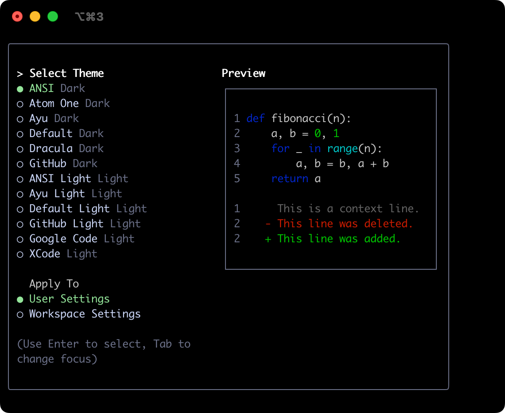

### Atom OneDark

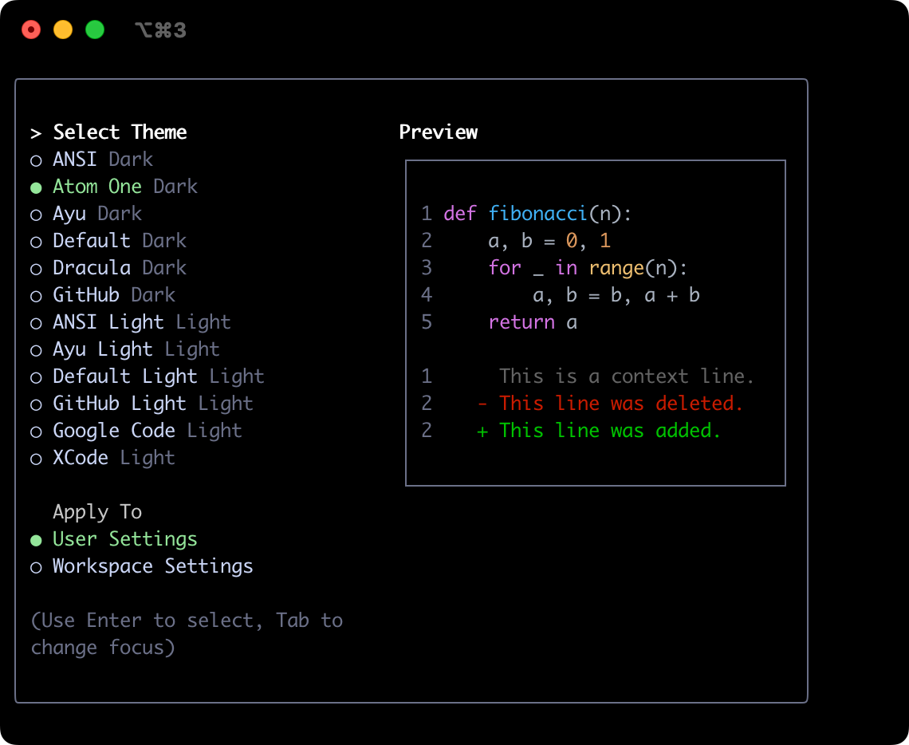

### Ayu

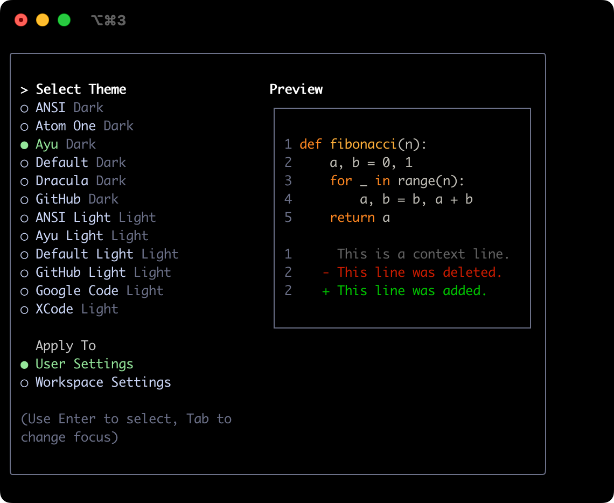

### デフォルト

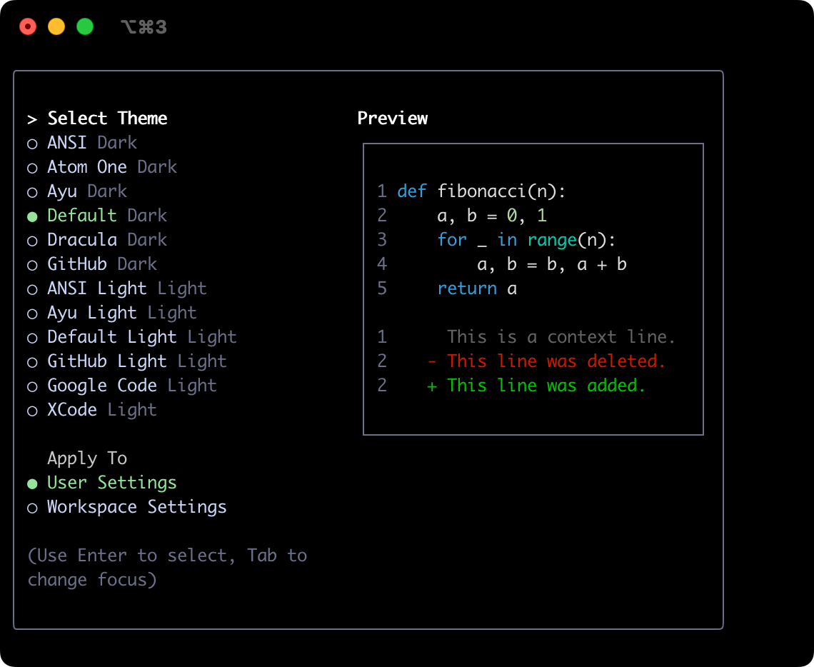

### Dracula

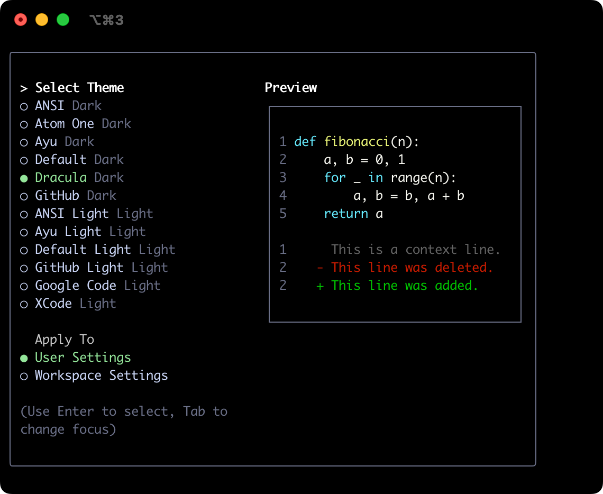

### GitHub

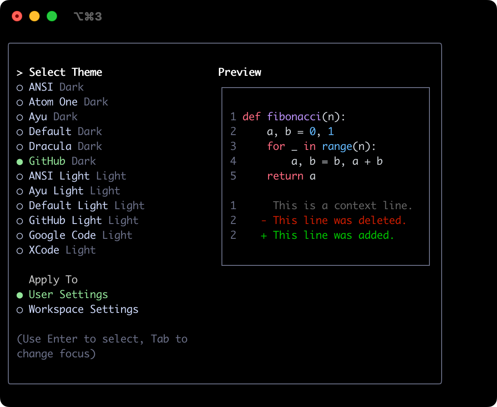

## ライトテーマ

### ANSI Light

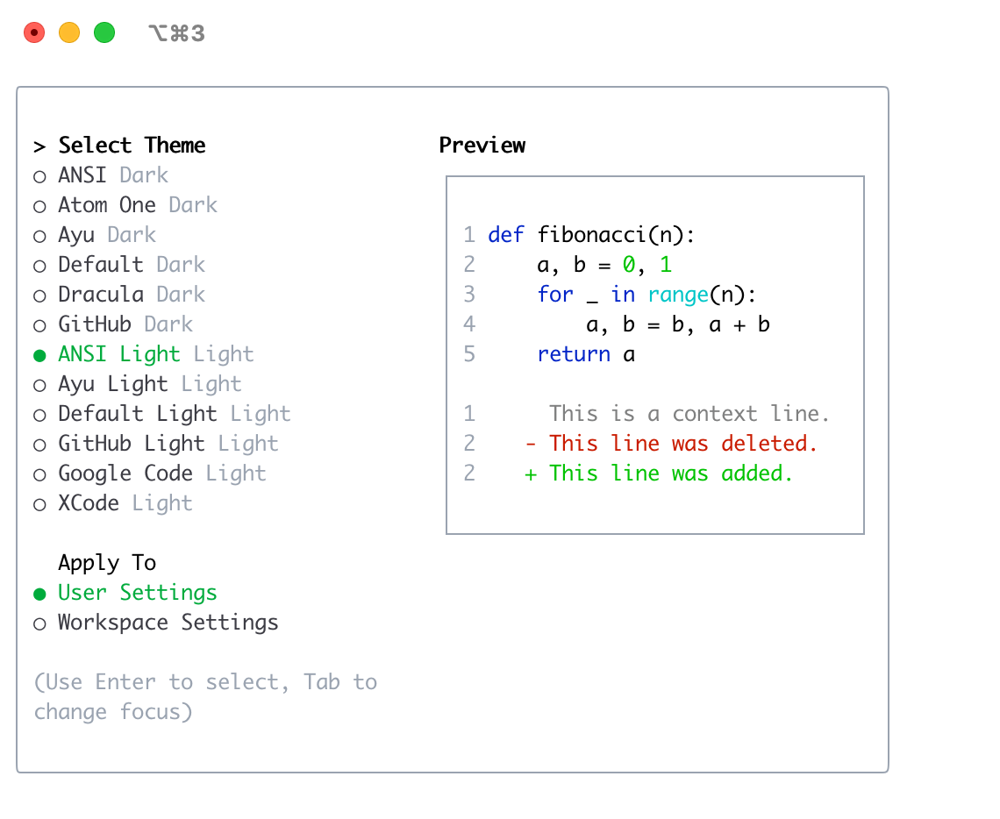

### Ayu Light

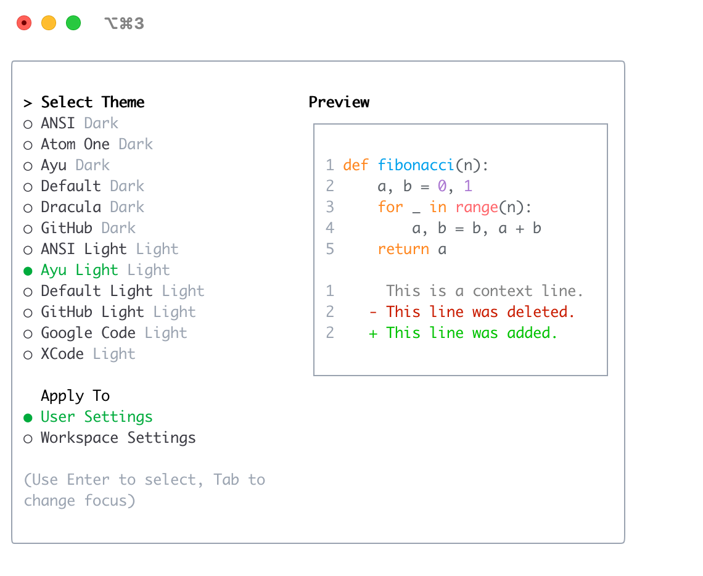

### デフォルトライト

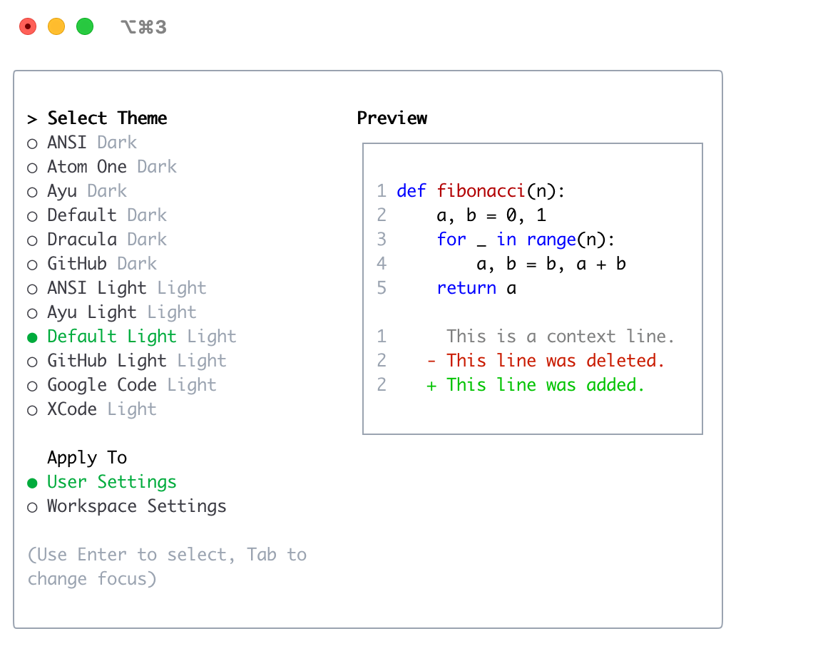

### GitHub Light

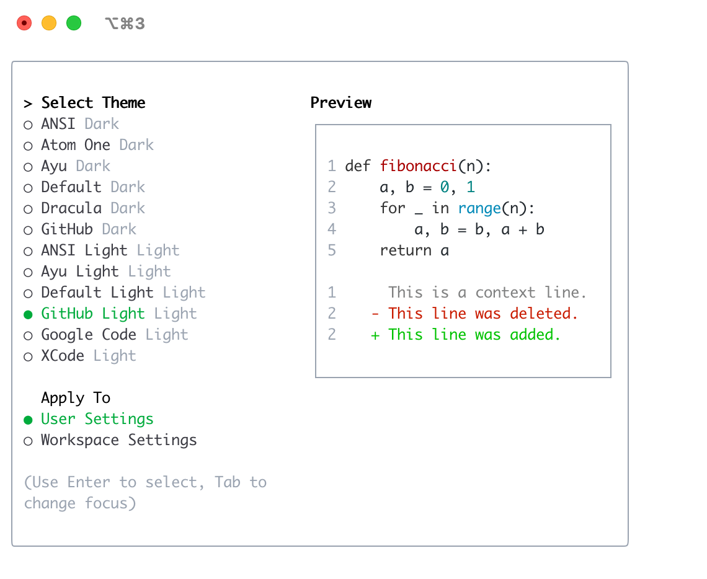

### Google Code

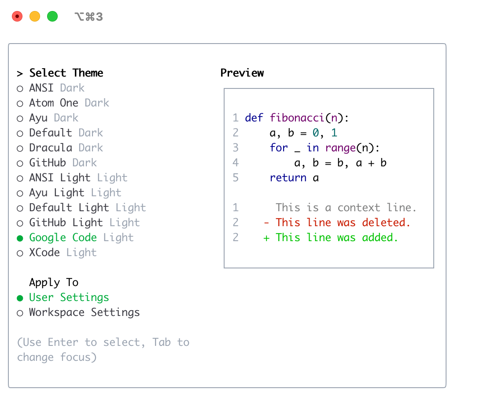

### Xcode

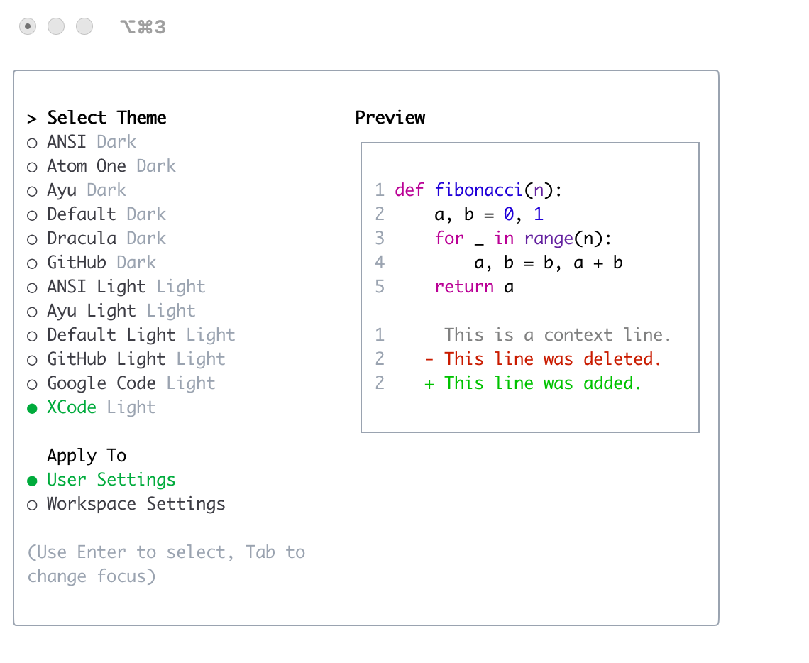